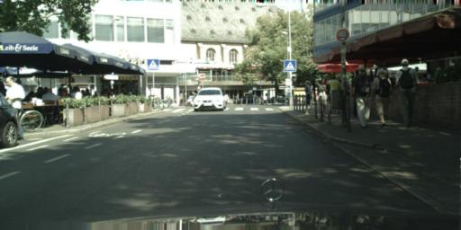
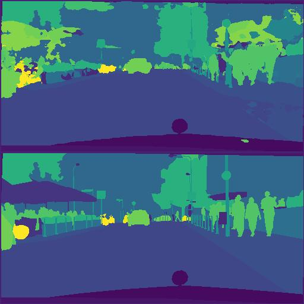
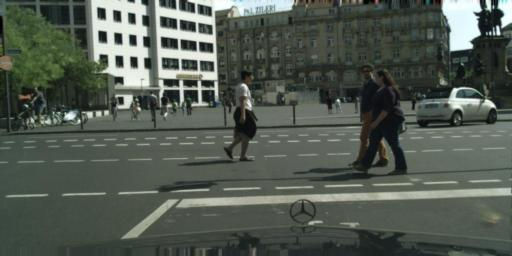
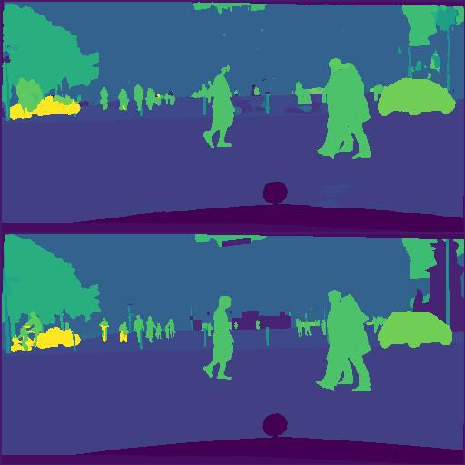

# DL-segmentation
We trained a residual Unet network to perform image segmentation on the Cityscapes Dataset.
Here you can view some sample results:
| Image                                        | Result (Bottom - Ground Truth, Top - Model output) | IoU        |
|----------------------------------------------|----------------------------------------------------|------------|
|   |        | 0.40464944 |
|    |        | 0.4845726  |

## Installation
Clone the repository and build the docker image with
```
docker build -t segmentation .
```
## Running inference
to run inference from the web interface with wandb use:
```
sudo docker  run -p 5000:5000 -v $(pwd):$(pwd) -w $(pwd) -it -t  segmentation sh -c "wandb login <your_api_key> && flask --app src/dl_segmentation/server/server run --host 0.0.0.0 --debug"
```
## Running pipelines
To download the dataset set `DOWNLOAD_DATASET=1` in `./src/consts.py` and provide your username and password for Cityscapes account.

```
sudo docker run -v $(pwd):$(pwd) -w $(pwd) -it -t  segmentation kedro run --pipeline=reporting
```

